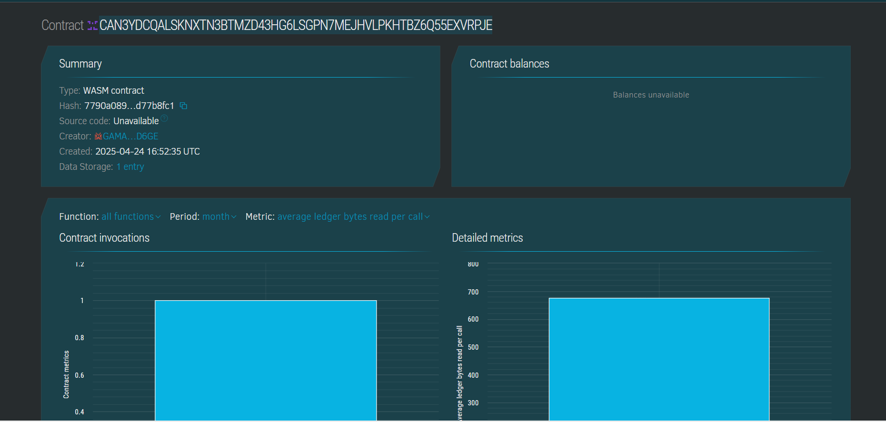

# Smart Parking System Using IoT

## Project Overview
The **Smart Parking System Using IoT** is a decentralized application (dApp) built on the **Stellar blockchain** using **Soroban smart contracts**. This system allows users to book, cancel, and track parking slots in real time with the help of IoT sensors. The use of blockchain ensures transparency and immutability, while IoT enhances the automation and real-time interaction of the parking system.

## Contract Address Details:
CAN3YDCQALSKNXTN3BTMZD43HG6LSGPN7MEJHVLPKHTBZ6Q55EXVRPJE


## Features
- **Slot Booking**: Users can reserve parking slots using a unique identifier.
- **Slot Cancellation**: Users can cancel their booking before using the parking slot.
- **Slot Status Viewer**: Anyone can view the current status (available or booked) of parking slots.
- **Immutable Transactions**: All bookings and cancellations are stored on the Stellar blockchain to ensure transparency and prevent any potential disputes.
- **IoT Integration**: The system integrates IoT sensors to automatically detect vehicle presence and update slot status in real-time.

## Technology Stack
- **Blockchain**: Stellar Network (Soroban smart contracts)
- **IoT**: Integration with IoT sensors for real-time parking slot updates
- **Frontend**: React (for web/mobile interface)
- **Backend**: Node.js, Express.js
- **Database**: SQLite (for storing user data temporarily)
- **Smart Contract Language**: Rust (using Soroban SDK)

## Installation

### Prerequisites
1. **Install Rust**: Follow the instructions from [Rust Official Website](https://www.rust-lang.org/tools/install) to install Rust.
2. **Install Stellar CLI**: Install the Stellar CLI to interact with the Stellar network.
   ```bash
   npm install -g stellar-cli
